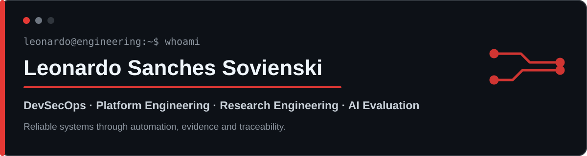

  

  
  

## Hi, I'm Leo — DevSecOps, Platform Engineering & Independent Research

Information Systems student at UNIFACEAR (expected Dec 2027), based in Curitiba, Brazil. Former DevOps Intern at Volvo Group IT, where I was the only DevOps engineer on my team and owned delivery end to end, from requirements to production.

I build delivery systems people can trust: pipelines as code, no hardcoded secrets, idempotent automation, build once and deploy the same artifact, and claims backed by evidence.

🟢 **Open to:** internship or junior roles in DevSecOps, Platform Engineering, Cloud and CI/CD · research collaborations and fellowships

📍 Curitiba, PR · on-site, hybrid or remote · open to relocation · available during the day

🗣️ Portuguese (native) · English (advanced, TOEIC 860)

---

## Experience

**DevOps Intern — Volvo Group IT** · Sep 2025 – Sep 2026

* Sole DevOps engineer on the team, handling demands end to end
* CI/CD pipelines with Azure DevOps and GitHub Actions for .NET applications
* Quality and security gates with SonarQube, Fortify and Sonatype Nexus IQ
* Azure deployments (App Service, Functions) using Key Vault and Entra ID
* Observability with Azure Monitor, Application Insights, Log Analytics and Diagnostic Settings
* Worked with Backstage as the internal developer portal
* Troubleshooting across pipelines, environments and platforms, documented as reusable runbooks

> My public repositories are personal or academic projects. They do not contain or represent proprietary company code.

---

## Projects

### Public — code available

**[CV Registration System](https://github.com/leonardosovienski/curriculos-ciee)** · `React` · `ASP.NET Core` · `SQL Server`

Full-stack application built as a technical challenge: résumé registration with a React front end, ASP.NET Core API and SQL Server.

**[Velour](https://github.com/leonardosovienski/Velour)** · `FastAPI` · `React` · `TypeScript` · `SQLAlchemy` · `JWT` · `pytest`

Academic salon management system with authentication, role-based access control, scheduling, loyalty, inventory, dashboards and automated tests.

**[Job Screening and CV Automation](https://github.com/leonardosovienski/automatizacao-curriculo)** · `Python` · `Pydantic` · `LLM APIs`

CLI that collects, validates, deduplicates and ranks job postings, combining deterministic rules with LLM output that is checked against source evidence. Includes caching, retries, circuit breakers and privacy controls.

### Research — private code, public evidence

**[Prediction Research Programme — Public Evidence Pack](https://github.com/leonardosovienski/ecosystem-predictor)** · `Python` · `Pre-registration` · `Temporal integrity` · `Reproducibility`

Public evidence of a multi-repository research programme that built prediction systems in three domains, found that its real problems were problems of evaluation, and responded with evidence discipline: pre-registered hypotheses, hash-identified qualification attestations, adversarial point-in-time tests, documented negative results and retractions, and a page of limitations. The environment uses shared versioned packages pinned by hash, CI on every active repository and explicit governance that separates "supported by evidence" from "profitable"; several hypotheses were closed as refuted and documented as such. Includes my undergraduate thesis core (shared methodological library).

**CAIN — Auditable AI-assisted research**

Independent research project on AI-assisted research that is auditable, verifiable and reproducible, keeping experimentation, evidence and decisions separate. The agent proposes experiments but never gains authority over evaluation, data or budget; containment is built and tested in integration with the three domains above. Working local prototype; the open scientific question is proposed, not yet run.

The implementation repositories are private to protect ongoing research. The public evidence pack above is the entry point; a technical report and a guided code walkthrough are available on request.

---

## Stack

* **CI/CD & DevSecOps** — `Azure DevOps` · `GitHub Actions` · `YAML` · `SonarQube` · `Fortify` · `Nexus IQ`
* **Cloud & Observability** — `Azure App Service` · `Azure Functions` · `Key Vault` · `Entra ID` · `Azure Monitor` · `Application Insights` · `Log Analytics`
* **Platform** — `Backstage` · `Docker` · `uv`
* **Development** — `Python` · `C#` · `.NET` · `FastAPI` · `ASP.NET Core` · `React` · `TypeScript` · `SQL`
* **Practices** — `Automated testing` · `Runbooks` · `Contracts` · `Reproducibility` · `Documentation`

---

## Education & Certifications

* 🎓 B.Sc. in Information Systems — UNIFACEAR (expected Dec 2027)
* 📚 Currently studying for Microsoft AZ-900

---

## Recognition

* 🏆 Winner — UNIFACEAR university hackathon
* 🥇 OBMEP award (Brazilian Mathematics Olympiad for Public Schools)

---

🌎 Em português

Estudante de Sistemas de Informação na UNIFACEAR (conclusão prevista em dez/2027), em Curitiba. Ex-estagiário de DevOps na Volvo Group IT, onde era o único DevOps do time e cuidava das entregas de ponta a ponta. Aberto a vagas de estágio ou júnior em DevSecOps, Platform Engineering, Cloud e CI/CD, e a parcerias de pesquisa. Contato: leonardo.sovienski@gmail.com

<b>Reliable delivery through automation, quality and traceability.</b>

